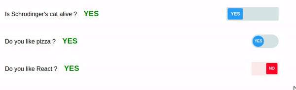

# react-toggle-switch

> TODO: Component Description

[](https://www.npmjs.com/package/react-toggle-switch) [](https://standardjs.com)



## Install

```bash
npm install --save react-toggle-switch
```

## Documentation

Read the full Documentation [here](https://react-multistate-toggler-demo.netlify.com)

## Advantages

Create highly customizable toggle switches with ease. Create toggle switches with 3 states.

## Usage

### Basic usage

```jsx
import React, { Component } from "react";
import ToggleButton from "react-multistate-toggler";

export default class App extends Component {
  state = {
    toggleState: null
  };

  handleChange = toggleState => {
    this.setState({ toggleState });
  };

  render() {
    const { toggleState } = this.state;
    return (
      <div>
        <p>Do you like Pizzas: <span style={{color: toggleState ? 'blue' : 'red'}}>{toggleState ? 'YES' : 'NO'}</span></p>
         <ToggleButton
          onChange={this.handleChange}
          initState={true}
          buttonDesign='angled'
          textData={{ stateOne: 'YES', stateTwo: 'NO' }}
        />
      </div>
    );
  }
}
```

### Creating toggle button with 3 states

```jsx
import React, { Component } from "react";
import ToggleButton from "react-multistate-toggler";

export default class App extends Component {
  state = {
    toggleState: false
  };

  handleChange = toggleState => {
    this.setState({ toggleState });
  };

  render() {
    return (
      <div>
        <p>Choose your gender <span>{this.state.toggleState}</span></p>
        <ToggleButton
          onChange={this.handleChange}
          initState={true}
          buttonDesign='rounded'
          buttonStates={3}
          fontSize='12px'
          textData={ stateOne: 'M', stateTwo: 'F', stateThree: 'T' }
        />
      </div>
    );
  }
}
```

## License

MIT © [Travis Fischer](https://github.com/transitive-bullshit)
